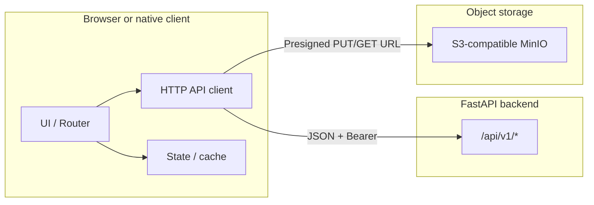

# Architecture blueprint for the frontend

## High-level system view

- **JSON REST** for almost all operations under `/api/v1`.
- **Direct uploads/downloads** to MinIO using **presigned URLs** returned by the API (not multipart file posts to FastAPI for CVs).

## Suggested frontend layering

| Layer | Responsibility |
|--------|----------------|
| **Config** | Base URL (`VITE_API_URL` / `NEXT_PUBLIC_API_URL` / env of your choice), feature flags. |
| **API client** | Single module: `fetch`/`axios` wrapper, attaches `Authorization`, parses errors, optional refresh retry. |
| **DTO mappers** | Map API JSON to view models if you need stable UI types (optional for MVP). |
| **Domain modules** | `auth`, `jobs`, `applications`, `companies`, `admin` — each exposes hooks/services calling the API client. |
| **UI routes** | Split by persona: **public**, **candidate**, **recruiter**, **admin** (see below). |

## Persona-based route slices

Align UI navigation with backend roles (`UserOut.role`: `candidate` | `recruiter` | `admin`).

| Persona | Typical UI areas | Backend prefixes |
|---------|------------------|------------------|
| **Public / anonymous** | Job search, job detail | `GET /api/v1/jobs`, `GET /api/v1/jobs/{id}` |
| **Authenticated (any)** | Profile, report job | `GET /api/v1/users/me`, `POST /api/v1/admin/reports/jobs/{job_id}` |
| **Candidate** | Apply, my applications, CV upload | `/api/v1/applications/*` (where `require_candidate`) |
| **Recruiter** | Companies, jobs CRUD, applications per job | `/api/v1/companies/*`, `/api/v1/jobs/*` (mutations), `/api/v1/applications/jobs/{job_id}` |
| **Admin** | Moderation queue, reports queue | `/api/v1/admin/*` |

## Job visibility rules (critical for UX)

- **Public list and detail** (`GET /jobs`, `GET /jobs/{job_id}`) only expose jobs with **`moderation_status === "approved"`**.
- **Recruiter list** (`GET /jobs/me`) returns jobs in companies the recruiter owns or is a member of, including **non-approved** moderation states.
- **Applying** (`POST /applications`) only succeeds for **approved** jobs; unapproved jobs surface as **`404`** with `"Job not found."` (same message as missing ID — by design in the service layer).

Frontend should:

- Show **moderation badges** on recruiter dashboards (`pending`, `approved`, `rejected`).
- After **PUT/PATCH** job updates, expect status to return to **`pending`** until admin approves again.

## API client boundaries

1. **Never** hardcode paths twice — centralize path builders (`/api/v1/...`).
2. **Token attachment**: only the API client (or an interceptor) should read the stored access token.
3. **Refresh**: on `401` with `"Access token expired."`, call `POST /auth/refresh` once, retry the original request, then logout on failure.
4. **Presigned URLs**: return opaque strings; open in new tab or `fetch`/`PUT` depending on flow (see [uploads-and-files.md](uploads-and-files.md)).

## OpenAPI as a secondary contract

When the server is running:

- **`GET /openapi.json`** — generate TypeScript types (openapi-typescript, orval, etc.) if desired.
- **`/docs`** — manual exploration and copy-paste of example payloads.

The markdown in `docs/frontend/` is the **human narrative**; OpenAPI is the **machine contract**.

## No server-push

There are **no WebSockets or SSE** endpoints. For “live” admin queues or application lists, use **polling** with sensible intervals or refetch on focus.
